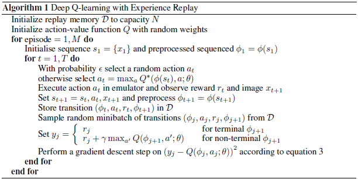
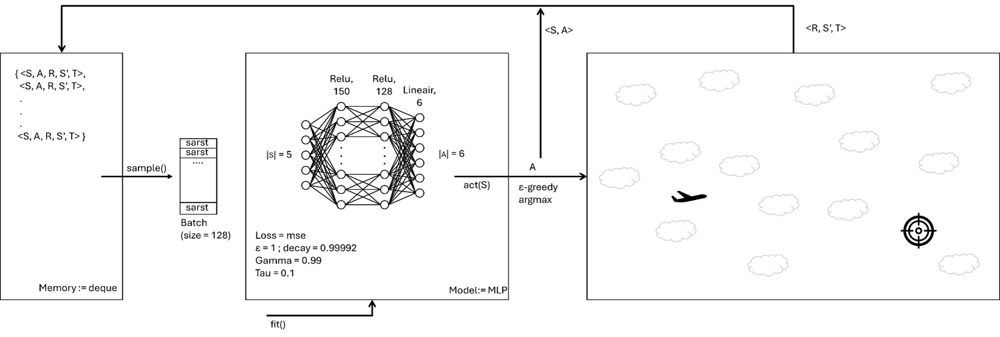
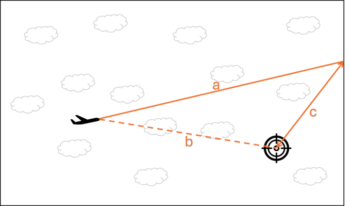

# Deep Q-learning

## Introductie
In de problemen tot nu toe hebben we het hele Markov Decision Process kunnen modelleren. We konden de value function kwijt in tabelvorm, die door een algoritme wordt gevuld om het beste gedrag aan te leren.

In deze opdracht gaan we aan de slag met een complexer probleem: de Target Terminator (ontwikkeld door Finn de Graaf, Bas de Blok en Joris Heemskerk). 

Er zijn in de simulatieomgeving 5 observaties, waarvan er 4 continu zijn: de coördinaten en de snelheden van het vliegtuig. De vijfde observatie is hoeveel targets er nog bestaan. We kunnen dit niet meer met een tabel leren, want die zou snel te groot worden.

De oplossing is om de tabel te vervangen door een function approximator. We gebruiken een neuraal netwerk om de functie te benaderen, die eerst door de tabel werd vertegenwoordigd. Het algoritme dat hierbij hoort heet Deep Q-learning, de complete oplossing noemen we een Deep Q-learning Network (DQN). De pseudocode voor het algoritme uit het originele [paper van Mnih et al. (2013)](https://arxiv.org/abs/1312.5602) staat hieronder:

## Opdracht
Implementeer object-geörienteerd een Deep Q-learning Network in Python. Train deze op de Target Terminator omgeving en rapporteer je resultaten op een inzichtelijke manier, bijvoorbeeld met een Jupyter notebook.

### Aanpak
0. Test of de omgeving werkt door in hello-world.ipynb acties uit te voeren op de omgeving. Zorg dat je inzicht krijgt in de states, rewards en actions van de omgeving. Kijk hiervoor ook naar de documentatie van de Target Terminator.
1. Maak een Agent klasse en een Policy klasse; de agent implementeer je met een epsilon-greedy policy:
    - De methode select_action() kiest een actie op basis van een gegeven state;
    - (optioneel) De methode decay() degradeert de epsilon over tijd.
2. Creëer een datastructuur voor een Transition. Een Transition is een tuple met daarin: state, action, reward, next state, terminated.
3. Schrijf een Memory klasse. Deze heeft een deque met daarin Transition objecten. Daarnaast heeft deze volgende de methoden:
    - De methode store() om nieuwe transities op te slaan;
    - De methode sample() om een batch aan transities uit het geheugen op te halen.
4. Voeg een neuraal netwerk toe aan je Policy als function approximator. Gebruik hiervoor PyTorch. Voeg de volgende functionaliteit toe:
    - Het netwerk voorspelt Q-values aan de hand van één of meerdere states - dit wordt gebruikt om het netwerk te trainen én om een actie te te selecteren;
    - Het netwerk kan getraind worden met een batch aan transities;
    - (optioneel) Het netwerk kan opgeslagen en geladen worden naar een bestand.
5. Voeg een train()-methode toe aan je Agent. Deze methode moet het neurale netwerk gaan verbeteren aan de hand van Deep Q-Learning - dit is de kern van deze opdracht.
    - Haal een batch transities op uit je Memory.
    - Voer nu de volgende stappen uit voor elke training example (één transitie) uit je batch. Realiseer je dat een transitie bestaat uit een state s, een genomen actie a, een reward r en de volgende state s'. Je kunt het netwerk in één keer trainen op een gehele batch, door de batch om te zetten naar tensoren. 
        1. Bepaal de Q-values van de volgende state s' met behulp van het neurale netwerk.
        2. Bepaal op basis van deze Q-values wat de beste vervolgactie a' is en de bijbehorende verwachte reward. Als de volgende state terminal is, dan is de verwachte reward natuurlijk 0.
        3. Bepaal de huidige Q-values voor gegeven state s.
        4. Bepaal de target Q-values Q*(s, a) door de huidige Q-values over te nemen en alléén de waarde van de genomen actie a te overschrijven met de Bellman equation. De waarde van genomen actie a wordt de reward r plus de verwachte reward van het nemen van vervolgactie a'. Vergeet hier de discount gamma niet.
6. Train tenslotte het neurale netwerk met de states s uit de batch als input en de target Q-values Q*(s, a) als de gewenste labels. (NB. In PyTorch kan je expliciet selecteren welke outputneuron je wil trainen, dus dat is een shortcut die je kan gebruiken.)
7. Pas je DQN toe op de Target Terminator omgeving en visualiseer het trainingsproces. Schrijf rapportage met daarin een analyse van het proces, het behaalde resultaat, problemen die je bent tegengekomen en eventuele vervolgstappen die je ziet.
8. (optioneel) Implementeer ook Double Deep Q-Learning, visualiseer en analyseer de resultaten.
9. (optioneel) Implementeer dit nu ook voor meerdere targets, visualiseer en analyseer de resultaten.

### Reward functie
De reward functie van de Target Terminator omgeving bestaat uit een aantal componenten. Het eerste component is de reward voor de kijkrichting van het vliegtuig ten opzichte van de target. Als de agent exact naar de target kijkt krijgt deze een reward van 0. Als de agent precies de verkeerde kant op kijkt krijgt deze een reward van -200. Onderstaande afbeelding illustreert hoe dit werkt. a is de vector van de kijkrichting van de agent, b is de vector van de agent tot de target en c is het verschil tussen de twee vectoren. Om c te berekenen worden de unit vectoren van a en b van elkaar afgehaald. De lengte van vector c is, wegens deze normalisatie, altijd tussen de 0 en de 2. Deze lengte wordt vervolgens vermenigvuldigd met -100, wat resulteert in een reward tussen -200 en 0. (In het geval van meerdere targets wordt de dichtstbijzijnde target gebruikt.)

Het tweede component van de reward is een straf voor het schieten. Elke kogel die de agent schiet geeft een extra reward van -5. Tenzij deze kogel in de toekomst de target gaat raken, dan krijgt de agent een positieve reward van 50. Op het moment dat een agent een kogel schiet wordt dus al berekend of deze kogel de target gaat raken voordat de kogel het scherm verlaat of despawnt. Zodra er bekend is dat een kogel een target gaat raken krijgt de agent geen extra positieve rewards meer voor het schieten van meerdere kogels die ook de target gaan raken. Eén kogel is namelijk voldoende om een target af te schieten, meerdere kogels zullen te laat aankomen.

Het laatste component van de reward is of de agent heeft gewonnen, is neergestort of er te lang over doet. Als de agent wint is de game terminated en krijgt de agent een extra reward van 200. Op het moment dat de agent er te lang over doet (een enkele episode duurt langer dan het maximaal aantal stappen) of neerstort, dan is de game truncated en krijgt de agent een negatieve reward van -100.

Deze drie componenten samen leveren een reward range op van tussen de -305 en +250 per staat.
`
